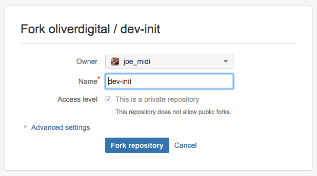

# dev-init

This is a basic [Bannertime](https://github.com/pyramidium/generator-bannertime) starter for junior developers in the OLIVER digital team.


## Getting Started

### Fork this repo

A fork creates a clone or copy of the repository from which you can work from without distrupting the main code base.

* Click on the fork menu item on left-hand navigation.



Which should bring you to this screen, and click *Fork repository*.

You should now have a copy of [dev-init](https://bitbucket.org/oliverdigital/dev-init) which you can work from in your own personal Github or BitBucket account.

#### Install Gulp Yeoman and Bannertime:
```bash
npm install --global gulp yo generator-bannertime
```

Both [Gulp](http://gulpjs.com/) and [Yeoman](http://yeoman.io/) are well documented tools, which you should take a look at.

[Bannertime](https://github.com/pyramidium/generator-bannertime) is an framework tool built on top of Gulp and Yeoman.

Once you've installed the global dependencies, you should install the local ones to this project, this list in which can be found in the [package.json](package.json).

```bash
npm install
```

#### Usage

Use `gulp` to automatically launch the banner into the browser with browsersync all your changes will be reflected in the browser with each file save.

Use `gulp prod` to generate a ZIP file of all the assets of the banner, these will all have been minified as well.

Use `gulp backup-gen` to automatically generate backup images for each banner.

#### Creating Elements

You can create DOM elements using the the `smartObject` function, this will initialise a `<div>` with the default style of: `position: absolute; top: 0; left: 0;`.

You are able to set a background image.

There are helper functions such as `center`, `centerHorizontal` and `centerVertical` to help you position the element.

Other settings are set using a helper function on the element which uses GSAP to process. So `this.logo.set({autoAlpha: 0, scale: 0.4});` is the same as `TweenLite.set(this.logo, {autoAlpha: 0, scale: 0.4});`

#### Animating

The banner animation is run by the `animate` function.

By default we are using TweenLite with TimelineLite, but you can change which flavour of GSAP as you require.

For more information about animating using GSAP head to [www.greensock.com](http://www.greensock.com)
